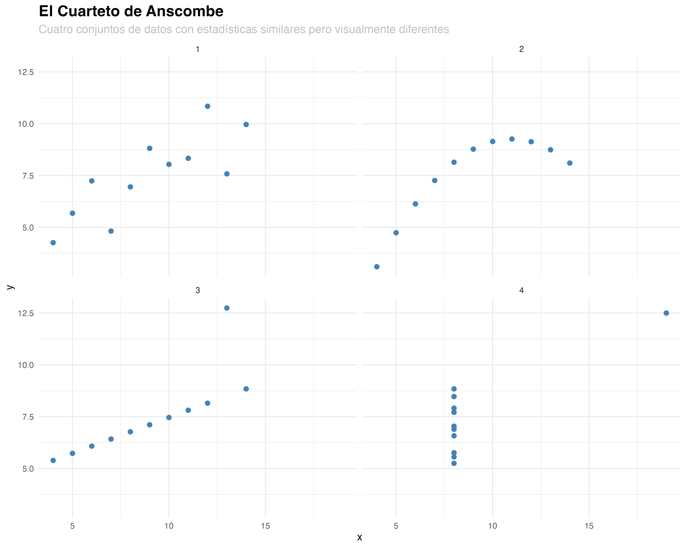
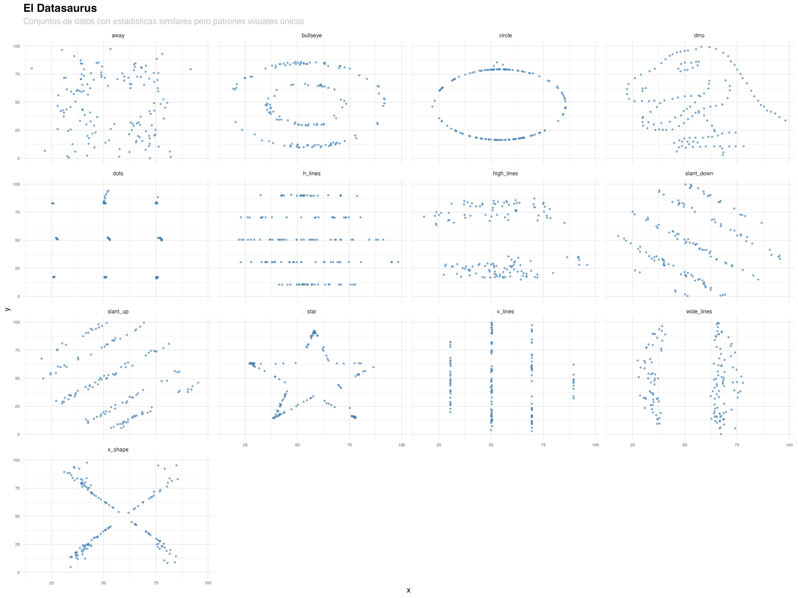

# Explorando el Cuarteto de Anscombe y el Datasaurus

## El Cuarteto de Anscombe

El Cuarteto de Anscombe es un conjunto de cuatro conjuntos de datos que nos ayudará a entender mejor cómo analizar datos. Fue creado por Francis Anscombe en 1973.

### Cálculo de Estadísticas

```r
# Función auxiliar para calcular estadísticas
calcular_estadisticas <- function(x, y) {
    c(
        media_x = mean(x),
        media_y = mean(y),
        sd_x = sd(x),
        sd_y = sd(y),
        correlacion = cor(x, y)
    )
}

# Calcular estadísticas para cada conjunto
estadisticas <- data.frame(
    conjunto1 = calcular_estadisticas(anscombe$x1, anscombe$y1),
    conjunto2 = calcular_estadisticas(anscombe$x2, anscombe$y2),
    conjunto3 = calcular_estadisticas(anscombe$x3, anscombe$y3),
    conjunto4 = calcular_estadisticas(anscombe$x4, anscombe$y4)
)
```

### Estadísticas Descriptivas

| Estadística | Conjunto 1 | Conjunto 2 | Conjunto 3 | Conjunto 4 |
|-------------|------------|------------|------------|------------|
| media_x | 9.0000 | 9.0000 | 9.0000 | 9.0000 |
| media_y | 7.5009 | 7.5009 | 7.5000 | 7.5009 |
| sd_x | 3.3166 | 3.3166 | 3.3166 | 3.3166 |
| sd_y | 2.0316 | 2.0316 | 2.0316 | 2.0316 |
| correlacion | 0.8164 | 0.8164 | 0.8163 | 0.8165 |

Observaciones sobre las estadísticas:

1. Todos los conjuntos tienen una media de X de 9.0000
2. Todos los conjuntos tienen una media de Y cercana a 7.5009
3. Las desviaciones estándar de X son aproximadamente 3.3166
4. Las desviaciones estándar de Y son aproximadamente 2.0316
5. Las correlaciones son todas cercanas a 0.8164

### Visualización



## El Datasaurus

El Datasaurus es una colección de conjuntos de datos creada por Justin Matejka y George Fitzmaurice en 2017. Nos ayudará a profundizar en nuestro análisis de datos.

### Cálculo de Estadísticas

```r
# Calcular estadísticas para cada conjunto del Datasaurus
estadisticas_datasaurus <- datasaurus_dozen %>%
    group_by(dataset) %>%
    summarise(
        media_x = mean(x),
        media_y = mean(y),
        sd_x = sd(x),
        sd_y = sd(y),
        correlacion = cor(x, y)
    )
```

### Estadísticas Descriptivas

| Dataset | Media X | Media Y | SD X | SD Y | Correlación |
|---------|---------|---------|-------|-------|-------------|
| away | 54.2661 | 47.8347 | 16.7698 | 26.9397 | -0.0641 |
| bullseye | 54.2687 | 47.8308 | 16.7692 | 26.9357 | -0.0686 |
| circle | 54.2673 | 47.8377 | 16.7600 | 26.9300 | -0.0683 |
| dino | 54.2633 | 47.8322 | 16.7651 | 26.9354 | -0.0645 |
| dots | 54.2603 | 47.8398 | 16.7677 | 26.9302 | -0.0603 |
| h_lines | 54.2614 | 47.8303 | 16.7658 | 26.9399 | -0.0617 |
| high_lines | 54.2688 | 47.8355 | 16.7667 | 26.9400 | -0.0685 |
| slant_down | 54.2679 | 47.8358 | 16.7668 | 26.9361 | -0.0690 |
| slant_up | 54.2659 | 47.8311 | 16.7688 | 26.9386 | -0.0686 |
| star | 54.2673 | 47.8395 | 16.7685 | 26.9303 | -0.0630 |
| v_lines | 54.2699 | 47.8365 | 16.7698 | 26.9378 | -0.0694 |
| wide_lines | 54.2669 | 47.8316 | 16.7697 | 26.9379 | -0.0666 |
| x_shape | 54.2607 | 47.8397 | 16.7699 | 26.9300 | -0.0656 |

Observaciones sobre las estadísticas:

1. Todos los conjuntos tienen una media de X cercana a 54.26
2. Todos los conjuntos tienen una media de Y cercana a 47.83
3. Las desviaciones estándar de X son aproximadamente 16.76
4. Las desviaciones estándar de Y son aproximadamente 26.93
5. Las correlaciones son todas cercanas a -0.06

### Visualización



## Reflexiones sobre el Análisis de Datos

Después de analizar estos conjuntos de datos, podemos extraer algunas conclusiones importantes sobre el análisis de datos:

1. **Las estadísticas descriptivas por sí solas pueden ser engañosas**: Como hemos visto en ambos ejemplos, conjuntos de datos con estadísticas muy similares pueden tener patrones visuales completamente diferentes.

2. **La visualización de datos es crucial**: Siempre debemos visualizar nuestros datos antes de realizar análisis estadísticos. Las gráficas nos pueden revelar patrones, tendencias y anomalías que no son evidentes en las estadísticas.

3. **No confiar ciegamente en los números**: Las estadísticas son herramientas poderosas, pero deben complementarse con visualizaciones para obtener una comprensión completa de los datos.

## Referencias

- Anscombe, F. J. (1973). "Graphs in Statistical Analysis". The American Statistician, 27(1), 17-21.
- Matejka, J., & Fitzmaurice, G. (2017). "Same Stats, Different Graphs: Generating Datasets with Varied Appearance and Identical Statistics through Simulated Annealing". CHI 2017 Conference Proceedings.
