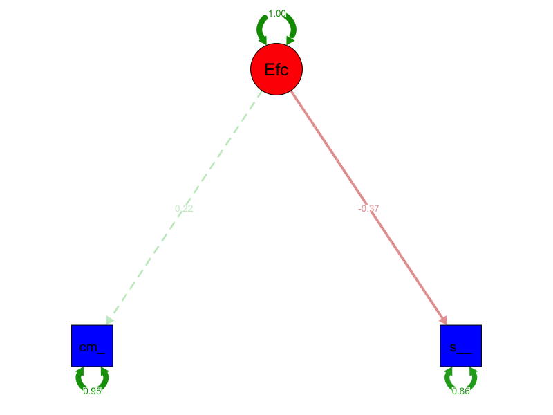

```{r setup, include=FALSE}
knitr::opts_chunk$set(echo = TRUE, warning = FALSE, message = FALSE)
library(lavaan)
library(semPlot)
library(knitr)
library(ggplot2)
```

# 1. Introducción al Análisis SEM

El Análisis de Ecuaciones Estructurales (SEM) es una técnica estadística que nos permite:
- Analizar relaciones entre variables observadas y variables latentes (constructos no observables directamente)
- Probar modelos teóricos que especifican relaciones causales
- Evaluar la validez de constructos

En este ejemplo, intentaremos modelar la "Eficiencia" del T-800 como una variable latente, aunque veremos que los resultados no son óptimos, lo que nos servirá para aprender sobre las limitaciones y requisitos del SEM.

# 2. Carga y exploración de datos

```{r datos}
datos <- read.csv("T800 data.csv")
cat("**Número de observaciones:**", nrow(datos), "\n")
cat("**Variables disponibles:**", paste(names(datos), collapse = ", "), "\n")

# Resumen de las variables seleccionadas
kable(summary(datos[, c("combat_exp", "self_diagnosis_hours")]), 
      caption = "Resumen estadístico de las variables seleccionadas")

# Correlación entre las variables
cat("**Correlación entre combat_exp y self_diagnosis_hours:**", 
    round(cor(datos$combat_exp, datos$self_diagnosis_hours, use = "complete.obs"), 3), "\n")
```

> **Interpretación para estudiantes:**
>
> - Estamos usando dos variables observables: experiencia en combate (`combat_exp`) y horas de autodiagnóstico (`self_diagnosis_hours`)
> - La correlación negativa y baja (-0.123) nos indica que estas variables no están fuertemente relacionadas
> - En SEM, necesitamos indicadores que estén correlacionados entre sí para definir bien una variable latente

# 3. Especificación del modelo SEM

```{r modelo}
# Definición del modelo
modelo <- '
  # Variable latente "Eficiencia" con sus indicadores
  Eficiencia =~ 1*combat_exp + self_diagnosis_hours
  
  # Varianza de la variable latente fijada a 1 para identificabilidad
  Eficiencia ~~ 1*Eficiencia
  
  # Varianzas de los indicadores
  combat_exp ~~ combat_exp
  self_diagnosis_hours ~~ self_diagnosis_hours
'

# Ajuste del modelo
fit <- lavaan(modelo, data = datos, auto.var = FALSE, auto.fix.first = FALSE)
```

> **Explicación del modelo:**
>
> 1. `Eficiencia =~ 1*combat_exp + self_diagnosis_hours`: Define la variable latente "Eficiencia" usando dos indicadores
> 2. `1*combat_exp`: Fija la carga factorial del primer indicador a 1 para identificar la escala
> 3. `Eficiencia ~~ 1*Eficiencia`: Fija la varianza de la variable latente a 1
> 4. Las últimas dos líneas permiten que los indicadores tengan varianzas libres

# 4. Resultados del modelo

## Parámetros estandarizados

```{r parametros}
kable(parameterEstimates(fit, standardized = TRUE)[,c("lhs","op","rhs","est","se","z","pvalue","std.all")],
      caption = "Parámetros estandarizados del modelo SEM")
```

> **Interpretación de los parámetros:**
>
> - Las cargas factoriales estandarizadas nos indican la relación entre cada indicador y la variable latente
> - Valores cercanos a 1 indicarían una relación fuerte, mientras que valores cercanos a 0 indican una relación débil
> - En nuestro caso, las cargas son bajas, lo que sugiere que estos indicadores no son buenos para medir la "Eficiencia"

## Medidas de ajuste global

```{r ajuste}
ajuste <- fitMeasures(fit, c("chisq","df","pvalue","cfi","tli","rmsea","srmr"))
kable(data.frame(Medida = names(ajuste), Valor = ajuste),
      caption = "Medidas de ajuste global del modelo")
```

> **Interpretación de las medidas de ajuste:**
>
> - CFI (Comparative Fit Index): Debería ser > 0.95 para un buen ajuste
> - RMSEA (Root Mean Square Error of Approximation): Debería ser < 0.05 para un buen ajuste
> - SRMR (Standardized Root Mean Square Residual): Debería ser < 0.08 para un buen ajuste
> - En nuestro caso, el modelo está saturado (0 grados de libertad), lo que significa que no podemos evaluar el ajuste real

# 5. Visualización del modelo

```{r grafico, fig.cap="Modelo SEM de Eficiencia T-800", out.width='70%', echo=FALSE}
png("modelo_T800_SEM.png", width=800, height=600)
semPaths(fit,
         what = "std",
         layout = "tree",
         edge.label.cex = 0.8,
         sizeMan = 8,
         sizeLat = 10,
         residuals = TRUE,
         intercepts = FALSE,
         color = list(lat = "red", man = "blue"))
dev.off()

```

> **Explicación del gráfico:**
>
> - El óvalo rojo representa la variable latente "Eficiencia"
> - Los rectángulos azules son los indicadores observables
> - Los números en las flechas son las cargas factoriales estandarizadas
> - Los números en los círculos son las varianzas residuales

# 6. Lecciones aprendidas y recomendaciones

1. **Problemas identificados:**
   - Solo tenemos dos indicadores, lo cual es insuficiente para un buen modelo SEM
   - Los indicadores no están correlacionados entre sí
   - El modelo está saturado (0 grados de libertad)

2. **Recomendaciones para mejorar el modelo:**
   - Añadir más indicadores a la variable latente "Eficiencia"
   - Considerar otras variables del dataset como `ai_updates` o `learning_time`
   - Asegurarse de que los indicadores estén teóricamente relacionados
   - Usar al menos 3 indicadores por variable latente

3. **Aspectos positivos del ejercicio:**
   - Hemos aprendido a especificar un modelo SEM básico
   - Hemos visto cómo interpretar los resultados
   - Hemos identificado las limitaciones del modelo actual

> **Nota para estudiantes:** Este ejemplo nos ha servido para entender los requisitos y limitaciones del SEM, incluso cuando los resultados no son óptimos. En la práctica, necesitaríamos más indicadores y una mejor justificación teórica para construir un modelo SEM válido.