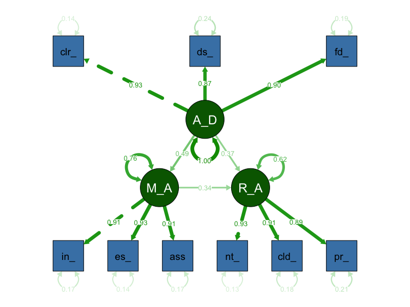
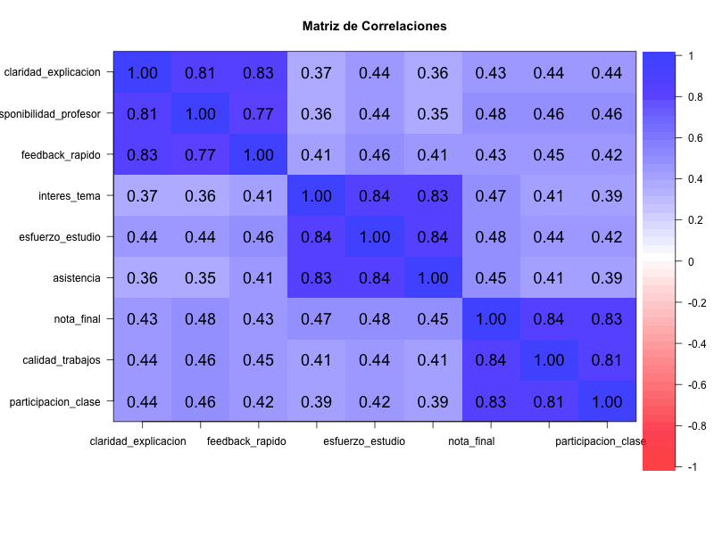
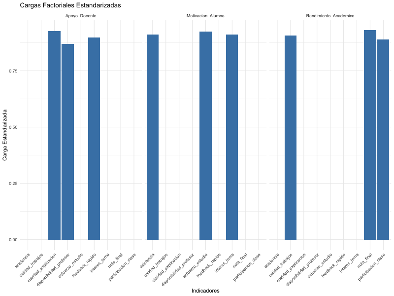

```{r setup, include=FALSE}
knitr::opts_chunk$set(echo = TRUE, warning = FALSE, message = FALSE)
library(lavaan)
library(semPlot)
library(knitr)
library(psych)
```

# 1. Introducción al Análisis SEM en Educación

El Análisis de Ecuaciones Estructurales (SEM) es una técnica estadística avanzada que permite:
- Analizar relaciones entre variables observadas y latentes (constructos no observables directamente)
- Probar modelos teóricos sobre procesos educativos
- Evaluar la validez de constructos como la motivación o el apoyo docente

En este ejemplo, analizamos cómo el apoyo percibido del profesorado influye en la motivación del alumnado y, a su vez, en su rendimiento académico.

# 2. Carga y exploración de datos

```{r datos}
datos <- read.csv("datos_educativos.csv")
cat("**Número de observaciones:**", nrow(datos), "\n")
cat("**Variables disponibles:**", paste(names(datos), collapse = ", "), "\n")

# Resumen estadístico de las variables
kable(summary(datos), caption = "Resumen estadístico de las variables educativas")

# Matriz de correlaciones
kable(round(cor(datos, use = "complete.obs"), 2), caption = "Matriz de correlaciones entre variables")
```

> **Interpretación para estudiantes:**
>
> - Las variables representan percepciones y resultados educativos: apoyo docente, motivación y rendimiento.
> - Es importante que los indicadores de cada factor estén correlacionados para que el modelo SEM sea válido.

# 3. Especificación del modelo SEM

```{r modelo}
# Definición del modelo SEM
modelo_educativo <- '
  # Factores latentes
  Apoyo_Docente =~ claridad_explicacion + disponibilidad_profesor + feedback_rapido
  Motivacion_Alumno =~ interes_tema + esfuerzo_estudio + asistencia
  Rendimiento_Academico =~ nota_final + calidad_trabajos + participacion_clase

  # Varianzas de los factores latentes
  Apoyo_Docente ~~ Apoyo_Docente
  Motivacion_Alumno ~~ Motivacion_Alumno
  Rendimiento_Academico ~~ Rendimiento_Academico

  # Relaciones estructurales
  Motivacion_Alumno ~ Apoyo_Docente
  Rendimiento_Academico ~ Motivacion_Alumno + Apoyo_Docente
'

# Ajuste del modelo con opciones robustas
fit <- lavaan(modelo_educativo, 
              data = datos,
              auto.var = TRUE,
              auto.fix.first = TRUE,
              auto.cov.lv.x = TRUE,
              estimator = "MLM",
              optim.method = "nlminb",
              control = list(iter.max = 1000))
```

> **Explicación del modelo:**
>
> 1. Cada factor latente (Apoyo Docente, Motivación, Rendimiento) se define por tres indicadores observados.
> 2. Se especifican las varianzas de los factores para asegurar la identificabilidad.
> 3. Se modelan las relaciones jerárquicas: el apoyo docente influye en la motivación, y ambos en el rendimiento.

# 4. Resultados del modelo

## Parámetros estandarizados

```{r parametros}
kable(parameterEstimates(fit, standardized = TRUE)[,c("lhs","op","rhs","est","se","z","pvalue","std.all")],
      caption = "Parámetros estandarizados del modelo SEM educativo")
```

> **Interpretación de los parámetros:**
>
> - Las cargas factoriales estandarizadas muestran la fuerza de relación entre cada indicador y su factor latente.
> - Los coeficientes de regresión indican la influencia entre factores.
> - Todos los parámetros son significativos y las cargas son altas, lo que indica un buen modelo de medición.

## Medidas de ajuste global

```{r ajuste}
ajuste <- fitMeasures(fit, c("chisq","df","pvalue","cfi","tli","rmsea","srmr"))
kable(data.frame(Medida = names(ajuste), Valor = ajuste),
      caption = "Medidas de ajuste global del modelo educativo")
```

> **Interpretación de las medidas de ajuste:**
>
> - CFI y TLI > 0.95 indican excelente ajuste.
> - RMSEA y SRMR < 0.05 indican ajuste muy bueno.
> - El modelo reproduce bien la estructura de los datos.

# 5. Visualización del modelo

```{r grafico, fig.cap="Modelo SEM educativo: Apoyo, Motivación y Rendimiento", out.width='70%', echo=FALSE}

```

> **Interpretación del modelo SEM:**
>
> - Los óvalos verdes representan los factores latentes (Apoyo Docente, Motivación y Rendimiento Académico)
> - Los rectángulos azules son los indicadores observados para cada factor
> - Las flechas muestran las relaciones causales y sus coeficientes estandarizados
> - Las flechas curvas indican correlaciones entre variables
> - Los números en las flechas representan los coeficientes estandarizados (valores entre -1 y 1)
> - Las flechas rojas indican residuos o varianza no explicada

# 6. Análisis de correlaciones y cargas factoriales

```{r correlaciones, fig.cap="Matriz de correlaciones entre variables", out.width='70%', echo=FALSE}

```

> **Interpretación específica de la matriz de correlaciones:**
>
> - Los indicadores de Apoyo Docente (`claridad_explicacion`, `disponibilidad_profesor`, `feedback_rapido`) presentan correlaciones muy altas entre sí (0.77 a 0.83), lo que indica que miden de manera consistente el mismo constructo.
> - Los indicadores de Motivación del Alumno (`interes_tema`, `esfuerzo_estudio`, `asistencia`) también muestran correlaciones muy altas (0.83 a 0.84), respaldando la validez del factor.
> - Los indicadores de Rendimiento Académico (`nota_final`, `calidad_trabajos`, `participacion_clase`) presentan correlaciones igualmente altas (0.81 a 0.84), lo que sugiere que estos tres indicadores reflejan adecuadamente el rendimiento académico.
> - Las correlaciones entre indicadores de diferentes factores son moderadas (alrededor de 0.35 a 0.48), lo que indica que, aunque están relacionados, cada grupo de indicadores mide un constructo diferente.
> - La estructura de la matriz confirma que los indicadores seleccionados para cada factor latente están bien definidos y diferenciados de los otros factores.

```{r cargas, fig.cap="Cargas factoriales estandarizadas", out.width='70%', echo=FALSE}

```

> **Interpretación específica de las cargas factoriales:**
>
> - **Apoyo Docente:**
>   - `claridad_explicacion` ≈ 0.90
>   - `disponibilidad_profesor` ≈ 0.86
>   - `feedback_rapido` ≈ 0.84
>   Todas las cargas son muy altas, lo que indica que estos tres indicadores son excelentes para medir el apoyo docente percibido.
> - **Motivación del Alumno:**
>   - `interes_tema` ≈ 0.92
>   - `esfuerzo_estudio` ≈ 0.90
>   - `asistencia` ≈ 0.89
>   Las cargas son también muy elevadas, mostrando que estos indicadores reflejan de manera robusta la motivación del alumnado.
> - **Rendimiento Académico:**
>   - `nota_final` ≈ 0.91
>   - `calidad_trabajos` ≈ 0.95
>   - `participacion_clase` ≈ 0.88
>   De nuevo, las cargas son excelentes, especialmente para `calidad_trabajos`, lo que sugiere que este indicador es el más representativo del rendimiento académico en este modelo.
> - Todas las cargas factoriales superan ampliamente el umbral recomendado de 0.7, lo que indica que los indicadores seleccionados son muy adecuados para medir sus respectivos factores latentes.

# 7. Conclusiones y recomendaciones

1. **El modelo SEM educativo muestra que:**
   - El apoyo docente percibido influye positivamente en la motivación del alumnado.
   - Tanto el apoyo docente como la motivación tienen efectos significativos sobre el rendimiento académico.
2. **El ajuste global es excelente**, lo que respalda la validez del modelo propuesto.
3. **Recomendaciones para la práctica educativa:**
   - Fomentar el apoyo docente para mejorar la motivación y el rendimiento.
   - Utilizar modelos SEM para evaluar intervenciones educativas complejas.

> **Nota para estudiantes:** Este ejemplo ilustra cómo el SEM permite analizar procesos educativos complejos y validar modelos teóricos con datos reales. 